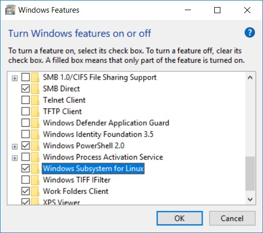

# How to Set up Windows Subsystem for Linux on Windows 10 for Docker/Kubernetes Development

### Table of Content
1. [Introcuction](#introcuction)
2. [Prerequisites](#prerequisites)
3. [Enable WSL Feature](#enable-wsl-feature)
4. [Install WSL](#install-wsl)
5. [Install Docker](#install-docker)
6. [Install Docker Compose](#install-docker-compose)
7. [Install Kubectl](#install-kubectl)
8. [Install Helm Client](#install-helm-client)

## Introcuction
This document will walk you through the processes to enable WSL on Windows 10. WSL will greatly improve your experience in Docker and Kubernetes development.

## Prerequisites
This document assumes that you have the latest version of Docker CE for Windows installed on your Windows 10 machine and configured with the following:
- Kubernetes has been enabled
- *Expose deamon on tcp://localhost:2375 without TLS* option is checked in Docker CE (this is required for connect Docker CLI client under WSL to Docker deamon running under Windows)

## Enable WSL Feature
Before you can install WSL, you have to enable it in *Turn Windows Feature On and Off* window, check *Windows Subsystem for Linux* and restart your computer.



## Install WSL
To install WSL, follow this [link](https://docs.microsoft.com/en-us/windows/wsl/install-manual), download the *Ubuntu 16.04* package to your local computer and duble-click the .appx file to install WSL.

Enter username and password when promoted.

## Install Docker
To install Docker under WSL, navigate to this [link](https://docs.docker.com/install/linux/docker-ce/ubuntu/) and follow instructions under *Install using the repository* section to install Docker CLI.

After installing Docker CLI, it's time to wire it up to the Docker deamon that is running under Windows. You can achieve this by setting the *DOCKER_HOST* environment varible in .bashrc as follows:
```
$ echo "DOCKER_HOST=tcp://127.0.0.1:2375 ; export DOCKER_HOST" >> ~/.bashrc
$ source ~/.bashrc
```

## Install Docker Compose
To Install Docker Compose under WSL, execute the following commands:
```
$ sudo curl -L https://github.com/docker/compose/releases/download/1.23.2/docker-compose-`uname -s`-`uname -m` -o /usr/local/bin/docker-compose
$ sudo chmod +x /usr/local/bin/docker-compose
```

## Install Kubectl
To install Kubectl under WSL, follow the instruction on this [link](https://kubernetes.io/docs/tasks/tools/install-kubectl/#install-kubectl) and execute the following commands
```
$ sudo apt-get update && sudo apt-get install -y apt-transport-https
$ curl -s https://packages.cloud.google.com/apt/doc/apt-key.gpg | sudo apt-key add -
$ sudo touch /etc/apt/sources.list.d/kubernetes.list 
$ echo "deb http://apt.kubernetes.io/ kubernetes-xenial main" | sudo tee -a /etc/apt/sources.list.d/kubernetes.list
$ sudo apt-get update
$ sudo apt-get install -y kubectl
```
Now that with Kubectl CLI installed, you need to wire it to the Kubernetes cluster that is running in Docker CE under windows. You can achieve this by setting the *KUBECONFIG* environment varible in .bashrc as follows:
```
$ USERNAME = {...your Windows username...}
$ echo "KUBECONFIG=/mnt/c/Users/$USERNAME/.kube/config ; export KUBECONFIG" >> ~/.bashrc
$ source ~/.bashrc
```
To upgrade kubectl to latest version:
```
curl -LO "https://dl.k8s.io/release/$(curl -L -s https://dl.k8s.io/release/stable.txt)/bin/linux/amd64/kubectl"
chmod +x ./kubectl
sudo mv ./kubectl $(which kubectl)
```
## Install Helm Client
This [link](https://docs.helm.sh/using_helm/#installing-helm) contains the official documentation on installing Helm. Follow the instructions under *From Scrip* section to install Helm CLI:
```
$ curl https://raw.githubusercontent.com/kubernetes/helm/master/scripts/get > get_helm.sh
$ chmod 700 get_helm.sh
$ ./get_helm.sh
```
